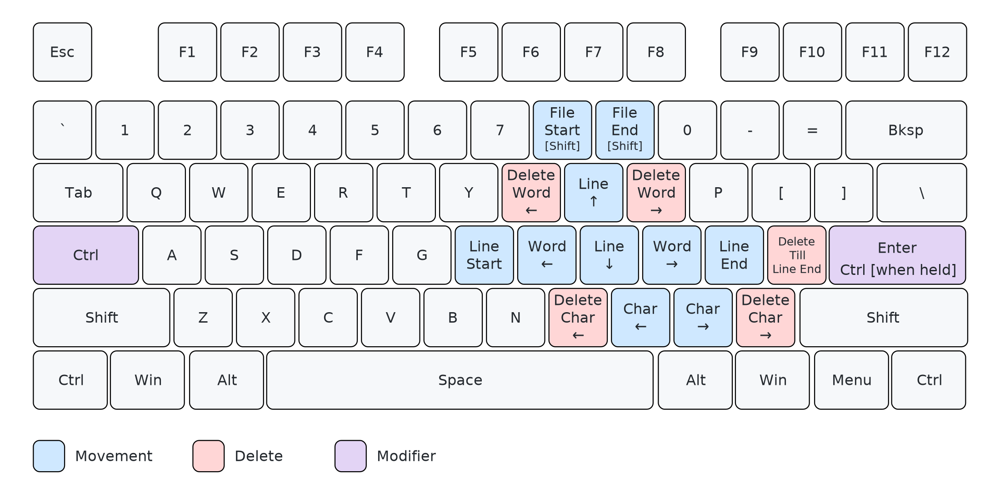

# Working With Text Without The Mouse - An AutoHotKey Script

When working with text (notes, emails), I prefer to keep my hands on the keyboard without using the mouse. Over the years I've refined which keyboard shortcuts work best for moving around within text and editing it. I put a lot of thought into which shortcut goes where based on the frequency of use.

Working with text without needing to reach for the mouse again and again is really great. It reduces the friction between thinking and getting the text written out. I highly suggest trying it out.

This single-file
[AutoHotkey **v1.1**](https://www.autohotkey.com/) script [`better-ctrl-ahk.ahk`](better-ctrl-ahk.ahk) is all that's needed to try it out.

These shortcuts are focused on **working with text**. Someone who spends more time programming than notes etc. might prefer a different set of shortcuts, but this works well for me when coding as well.

## Moving by character, word, and line

The heart of it is being able to move the cursor at three granularities, **character**, **word**, and **line**, without using the mouse.

| Granularity | Left / Up            | Right / Down          |
| ----------- | -------------------- | --------------------- |
| Character   | `Ctrl+,`             | `Ctrl+.`              |
| Word        | `Ctrl+J`             | `Ctrl+L`              |
| Line (go up/down) | `Ctrl+I`          | `Ctrl+K`              |
| Line (go to start/end) | `Ctrl+H`        | `Ctrl+;`              |
| File (go to start/end) | `Ctrl+Shift+8`  | `Ctrl+Shift+9`        |

Deletion follows the same character / word idea: 
- `Ctrl+M` / `Ctrl+/` delete the character before / after the caret
- `Ctrl+U` / `Ctrl+O` delete the word before / after it 
- `Ctrl+'` deletes the text from cursor till the end of the line

## Caps Lock as Ctrl

All of the above works best when **`Caps Lock` key is used as `Ctrl`**. It sits right on the home row, so every one of these motions becomes a comfortable, low-effort shortcut instead of a pinky stretch to the corner of the keyboard.

## Enter as Ctrl, too

As an additional feature, **`Enter` also acts as `Ctrl` when held** (a quick tap still sends a normal `Enter`). Having a `Ctrl` under the right hand makes common shortcuts on the left hand side, like `Ctrl+A` and `Ctrl+F`, very comfortable as well.

## Getting Caps Lock back

If you still need actual `Caps Lock`, it's remapped onto the **`Insert`** key, wherever `Insert` happens to live on your keyboard.

## Getting started

1. Install AutoHotkey **v1.1**.
2. Run [**`better-ctrl-ahk.ahk`**](better-ctrl-ahk.ahk).
3. (Optional) add a shortcut to it in your Startup folder to load it at startup.

> The `I/J/K/L` motion cluster is suppressed while in **Emacs** or **VS Code** as I prefer to set these up directly within those applications.
